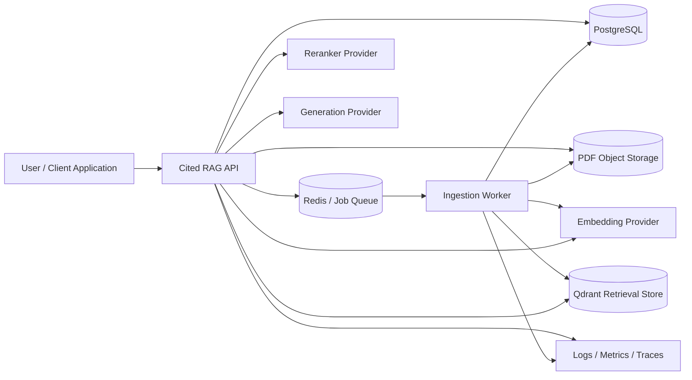
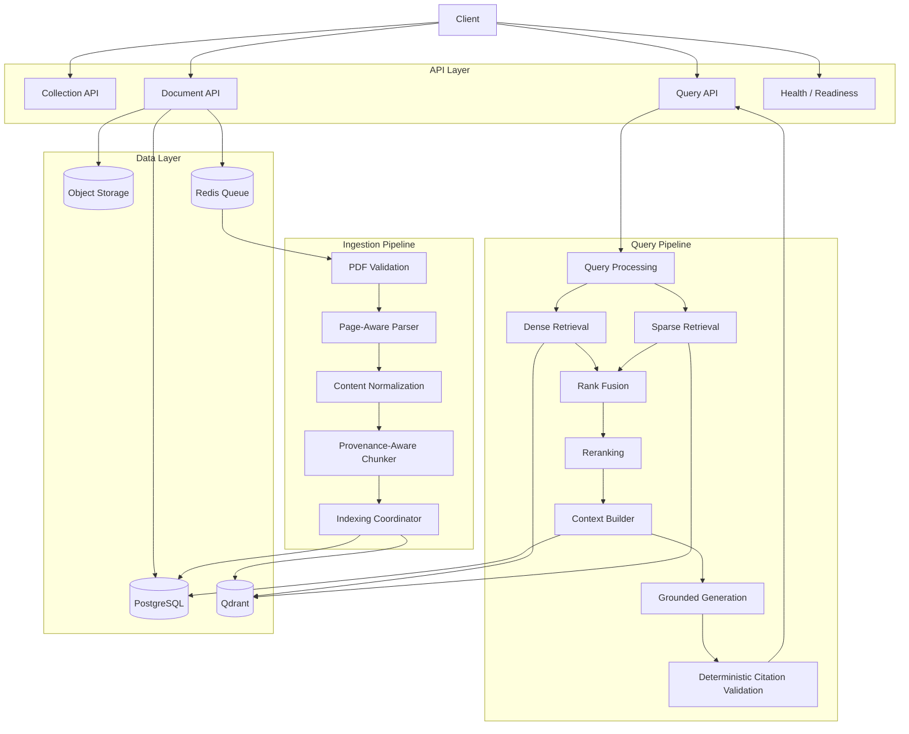
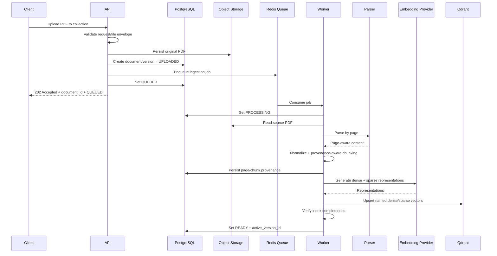
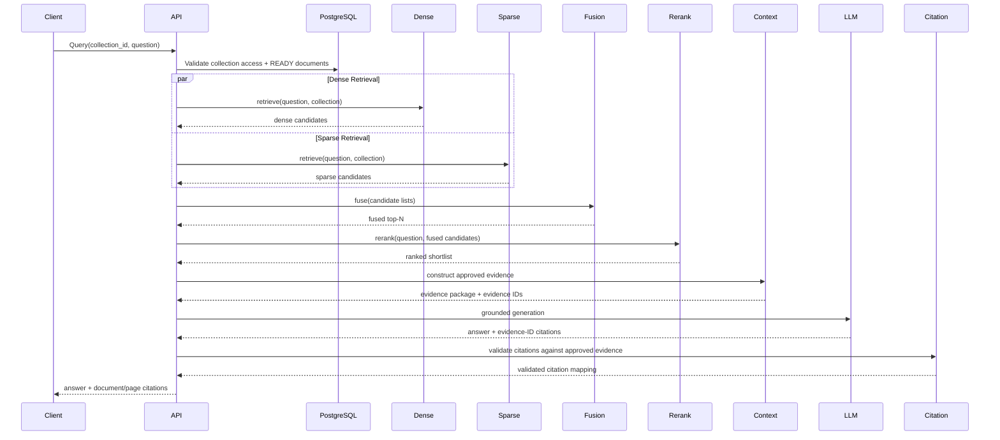
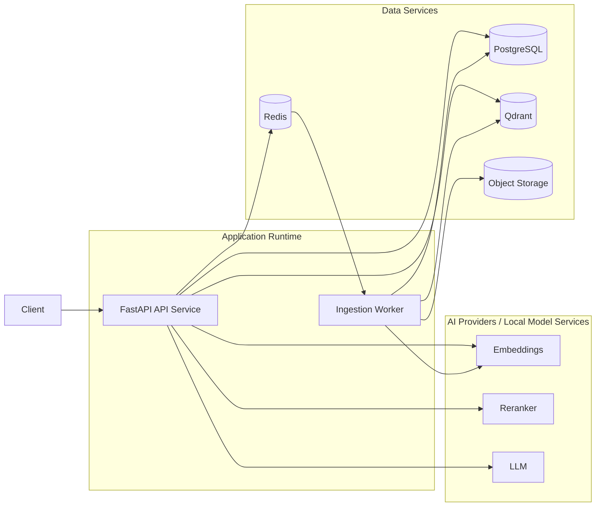

# Step 3 — High-Level Design (HLD)

**Project:** Cited RAG Bot  
**Status:** Accepted for implementation (ADR-011 freeze)  
**Version:** 1.1  
**Scope:** PDF-only, multi-document Cited RAG with page-level citations

> This HLD is based on the PRD and accepted ADRs, including ADR-011. System boundaries stay stable if an adapter implementation changes. V1 product contracts in ADR-011 are not optional.

---

## 1. Purpose

This document defines the high-level architecture for a production-oriented RAG service that:

- ingests one or more PDFs into logical collections;
- preserves provenance from PDF page to indexed chunk;
- retrieves evidence using dense + sparse search;
- fuses and reranks candidates;
- generates answers only from approved evidence;
- returns page-level citations;
- validates citations before returning the response;
- supports controlled no-answer behavior;
- exposes enough telemetry and intermediate results to evaluate and debug the system.

The architecture deliberately separates ingestion, retrieval, generation, citation validation, metadata persistence, and evaluation so each layer can be tested and improved independently.

---

## 2. Architecture Goals

1. **Evidence-first answering** — generation is downstream of retrieval and must not bypass retrieved evidence.
2. **Citation integrity** — document/page/chunk identities are application-owned, not invented by the model.
3. **Page provenance preservation** — source page identity survives parsing, chunking, indexing, retrieval, reranking, and generation.
4. **Replaceable providers** — parser, embedding model, retrieval store, reranker, and generation model sit behind interfaces.
5. **Independent ingestion and query scaling** — long-running PDF processing must not block request threads.
6. **Evaluation-ready architecture** — intermediate candidates and scores must be observable for offline evaluation.
7. **Failure transparency** — partial failures must be classified and handled explicitly.
8. **No-answer is a valid success outcome** — the system must prefer insufficient-evidence responses to hallucination.

---

## 3. System Context



### External actors

- **User / Client Application** — creates collections, uploads PDFs, checks ingestion status, asks questions.
- **Embedding Provider** — generates dense embeddings and, depending on implementation, sparse representations.
- **Reranker Provider** — scores query/evidence relevance after retrieval.
- **Generation Provider** — produces grounded answers from approved evidence only.

### Core infrastructure

- **PostgreSQL** — durable system of record for collections, documents, document versions, pages/chunks, ingestion state, query/audit metadata, and evaluation metadata.
- **Qdrant** — derived retrieval index for dense + sparse search.
- **Redis / Queue** — asynchronous ingestion coordination and short-lived operational state.
- **Object Storage** — retained source PDFs via local development adapter or S3-compatible production adapter.

---

## 4. High-Level Component Architecture



---

## 5. Major Logical Components

### 5.1 API Layer

Responsibilities:

- request validation;
- authentication/authorization boundary;
- collection scoping;
- request/correlation ID generation;
- API contract translation;
- orchestration entry points;
- consistent error responses;
- health/readiness endpoints.

The API layer must not contain retrieval algorithms, chunking logic, or provider-specific SDK code.

---

### 5.2 Collection Service

A collection is the logical query boundary for a group of PDFs.

Responsibilities:

- create/read collection metadata;
- enforce ownership/access boundaries;
- scope retrieval to the requested collection;
- prevent accidental cross-collection retrieval.

---

### 5.3 Document Service

Responsibilities:

- validate upload metadata;
- create document/document-version records;
- persist source PDF through object-storage abstraction;
- enqueue ingestion;
- expose ingestion status;
- coordinate deletion/tombstoning and index cleanup.

Document lifecycle:

```text
UPLOADED -> QUEUED -> PROCESSING -> READY
                               \-> FAILED
READY -> DELETING -> DELETED
```

A document must never participate in retrieval before the version reaches `READY`.

---

### 5.4 Ingestion Worker

Long-running ingestion occurs outside the request/response lifecycle.

Responsibilities:

1. load retained PDF;
2. validate file integrity and supported characteristics;
3. parse by page;
4. normalize extracted content;
5. chunk text while preserving provenance;
6. generate dense embeddings and sparse representations;
7. write retrieval artifacts;
8. persist durable metadata;
9. atomically transition document version to `READY` only after required indexing succeeds;
10. classify and persist failure state when ingestion cannot complete.

The initial proposed parser is Docling behind a `DocumentParser` abstraction.

---

### 5.5 Parser Abstraction

Conceptual interface:

```text
DocumentParser
    input: source PDF
    output: ordered PageContent[]
```

Every page result must preserve the original PDF page number and extracted structure required by downstream chunking.

The HLD does not require downstream services to depend directly on Docling.

---

### 5.6 Provenance-Aware Chunker

The chunker converts parsed page content into indexable evidence units.

Every chunk must preserve at minimum:

- collection_id;
- document_id;
- document_version;
- page_number or explicit page range;
- chunk_id;
- chunk_order;
- normalized chunk text.

Chunking configuration is an evaluation variable, not an invisible constant.

---

### 5.7 Retrieval Layer

Retrieval is split into independent strategies behind retriever interfaces.

#### Dense retriever

Finds semantically similar evidence using query embeddings.

#### Sparse retriever

Finds lexically relevant evidence for exact terms, identifiers, names, numbers, and uncommon terminology.

#### Hybrid coordinator

Runs both retrieval strategies and combines candidates.

The proposed V1 fusion strategy is Reciprocal Rank Fusion (RRF) because it avoids direct comparison of incompatible dense and sparse score scales.

---

### 5.8 Reranker

The reranker receives the fused candidate set and the user query, then produces a relevance-ordered shortlist.

It must be behind a provider-neutral interface so local cross-encoders or hosted reranking services can be compared without restructuring the query pipeline.

The system must retain enough pre/post-rerank data to measure whether reranking actually improves retrieval quality.

---

### 5.9 Context Builder

Responsibilities:

- accept only approved reranked evidence;
- enforce max evidence count and context-token budget;
- deduplicate/merge evidence when justified;
- preserve evidence identity;
- produce a model-facing context where each evidence item carries a system-generated citation/evidence ID.

The context builder is the trust boundary between retrieval and generation.

---

### 5.10 Grounded Generation Service

Responsibilities:

- construct system instructions separate from untrusted PDF text;
- instruct the LLM to answer only from supplied evidence;
- require citations using only supplied evidence IDs;
- support explicit insufficient-evidence output;
- record generation latency/token metadata;
- never expose provider-specific behavior to core query orchestration.

Retrieved PDF text must always be treated as untrusted data.

---

### 5.11 Citation Validator

The application, not the model, owns citation truth.

Validation must verify that every returned citation:

1. refers to an evidence ID supplied in the generation context;
2. maps to a real chunk;
3. maps to the correct document/version/page;
4. belongs to the current collection;
5. was part of the approved evidence set for this request.

If citation structure fails validation, the response must not silently return fabricated provenance.

Semantic citation correctness — whether the evidence truly supports the claim — is measured separately by the evaluation harness.

---

### 5.12 Evaluation Harness

Evaluation is logically separate from online query serving but consumes the same retriever, reranker, context-builder, generator, and citation-validation interfaces.

The harness must support:

- retrieval-only evaluation;
- before/after reranker comparison;
- answer faithfulness/relevance evaluation;
- citation validity/correctness/completeness evaluation;
- no-answer evaluation;
- configuration/model comparisons against a versioned golden dataset.

Exact evaluation design is Step 5 and must be completed before LLD is frozen.

---

## 6. Ingestion Architecture



### Ingestion consistency rule

`READY` is a semantic promise: all mandatory retrieval artifacts required by V1 must be available. Partial indexing must never result in `READY`.

Recovery strategy for partial writes will be detailed in LLD.

---

## 7. Query / Retrieval Architecture



---

## 8. No-Answer Flow

A query should terminate with `INSUFFICIENT_EVIDENCE` when evidence cannot support a trustworthy answer.

Potential signals include:

- no retrieval candidates;
- insufficient relevance after reranking;
- context builder cannot construct acceptable evidence;
- generation explicitly indicates evidence insufficiency;
- configured evidence-confidence policy fails.

Exact thresholds must be established through evaluation rather than guessed in the HLD.

---

## 9. Data Ownership Model

### PostgreSQL — authoritative state

Owns durable entities and provenance such as:

- collections;
- documents;
- document versions;
- pages;
- chunks and source mapping;
- ingestion jobs/status/history;
- query audit metadata where retained;
- deletion/tombstone state;
- evaluation datasets/runs where appropriate.

### Qdrant — derived retrieval state

Owns searchable representations containing enough identifiers/filter metadata to return candidate chunk identities quickly.

Qdrant must not become the only copy of citation provenance.

### Object Storage — source binary

Owns retained original PDF versions.

### Redis — ephemeral coordination

Owns queue/job coordination and optional short-lived operational state, not authoritative document metadata.

---

## 10. Security Architecture

High-level controls:

- authentication at API boundary;
- collection-level authorization before document/query operations;
- server-side file type/size validation;
- parser isolation/resource limits for untrusted PDFs;
- system prompts separated from retrieved PDF content;
- retrieved text explicitly labeled as untrusted evidence;
- secrets through environment/secret management, never repository files;
- collection filters enforced in every retrieval path;
- sensitive prompts/evidence not logged by default;
- deletion removes or invalidates searchable retrieval artifacts;
- resource limits around upload, ingestion, query size, and concurrency.

Portfolio V1 authentication is API-key (`Authorization: Bearer <api_key>`) with collection ownership (ADR-011).

---

## 11. Observability Architecture

Every ingestion and query receives correlation identifiers.

### Query trace

```text
HTTP request
  -> access validation
  -> query preprocessing
  -> dense retrieval
  -> sparse retrieval
  -> fusion
  -> reranking
  -> context construction
  -> generation
  -> citation validation
  -> response
```

### Required telemetry categories

- stage latency;
- candidate counts;
- dense/sparse/fused/reranked identifiers for debug/evaluation paths;
- model/provider metadata;
- generation token usage;
- no-answer count;
- citation-validation failures;
- ingestion failures by stage;
- external dependency failures.

High-cardinality IDs belong in traces/logs, not uncontrolled metric labels.

---

## 12. Failure and Degraded-Mode Principles

### Ingestion

- corrupt/unsupported PDF -> `FAILED`, never searchable;
- parser failure -> `FAILED` with classified reason;
- embedding/index write failure -> document version must not become `READY`;
- retry must be idempotent at document-version level.

### Query

- no relevant evidence -> controlled no-answer;
- reranker unavailable -> `RERANKER_ERROR` in production; evaluation may disable rerank via run config;
- generation provider unavailable -> controlled provider error, no fabricated answer;
- citation validation failure -> fail/repair according to LLD policy; never return unvalidated citations.

### Retrieval component failure

Production V1 is fail-closed when dense or sparse retrieval is operationally unavailable. One retriever returning zero hits is not a failure; fuse the surviving list. Silent dense-only or sparse-only answers are forbidden. Evaluation ablations use `EvaluationRunConfig`, not production degraded mode (ADR-011).

---

## 13. Scalability Model

### Independently scalable workloads

- **API/query service** — scales for interactive queries.
- **ingestion workers** — scale for CPU/memory-heavy parsing and embedding workloads.
- **PostgreSQL** — durable state and metadata queries.
- **Qdrant** — retrieval workload.
- **provider APIs/local models** — independently replaceable/scalable adapters.

V1 should start operationally simple while preserving these boundaries in code.

---

## 14. Deployment View



### Development deployment

A local Docker Compose environment should eventually provide at least:

- API;
- worker;
- PostgreSQL;
- Redis;
- Qdrant;
- local object-storage adapter or mounted storage.

Provider APIs may remain external initially.

Production deployment topology is intentionally not frozen to Kubernetes in V1.

---

## 15. API Capability Boundaries

Expected external capabilities remain:

```text
POST   /v1/collections
GET    /v1/collections/{collection_id}

POST   /v1/collections/{collection_id}/documents
GET    /v1/documents/{document_id}
DELETE /v1/documents/{document_id}

POST   /v1/collections/{collection_id}/query

GET    /health
GET    /ready
```

Exact request/response schemas, HTTP status codes, pagination, authentication details, and idempotency behavior belong in LLD.

---

## 16. Key Architectural Invariants

These rules must survive implementation choices:

1. A citation cannot exist without a real evidence mapping.
2. A chunk cannot lose its source document version/page provenance.
3. A document cannot be queryable before required indexes are complete.
4. Retrieval must always be scoped by collection/access boundary.
5. Generation receives only approved context.
6. PDF text cannot override system/application instructions.
7. Provider SDKs cannot leak into core domain interfaces.
8. Retrieval and reranking stages must be independently measurable.
9. Search indexes are rebuildable derived state.
10. No-answer behavior is part of the product contract.

---

## 17. Decisions Locked for Implementation

Resolved by accepted ADRs and ADR-011:

1. Docling behind `DocumentParser`.
2. PostgreSQL + Qdrant split.
3. Sparse retrieval inside Qdrant named vector `sparse`; default FastEmbed BM42.
4. In-process RRF (`FusionStrategy`).
5. Local cross-encoder preferred; reranker failure is `RERANKER_ERROR`.
6. Fail-closed on retriever dependency failure; empty lists fuse.
7. Redis-backed queue; V1 adapter arq.
8. Source PDFs retained until document/version deletion.
9. API-key authentication and collection ownership.
10. Numeric evaluation thresholds after the first baseline, not before.

See ADR-011 for lifecycle, versioning, Qdrant schema, citations, and READY filters.

---

## 18. HLD Review Checklist

Before Step 3 is marked complete, verify:

- PRD requirements are represented in architecture;
- every citation has an end-to-end provenance path;
- ingestion and query workloads are separated;
- data ownership across PostgreSQL/Qdrant/object storage/Redis is unambiguous;
- provider-specific dependencies are behind adapters;
- no-answer behavior has an architectural path;
- retrieval, reranking, generation, and citation stages are independently observable;
- evaluation harness can access intermediate outputs;
- failure behavior does not silently produce searchable partial state;
- security boundaries prevent cross-collection retrieval and document prompt injection.

---

## 19. Exit Criteria for Step 3

Step 3 is complete when:

- this HLD has been reviewed against the PRD and ADR set;
- unresolved Step 2 decisions are either accepted or explicitly carried as LLD blockers;
- system/component boundaries are accepted;
- ingestion and query flows are accepted;
- data ownership is accepted;
- security and observability boundaries are accepted;
- no major architecture contradiction remains.

The next activity is **Step 4 — Architecture Diagrams**, where the HLD views are converted into a focused diagram set for system context, ingestion, retrieval/query, sequence, and runtime/deployment understanding.
