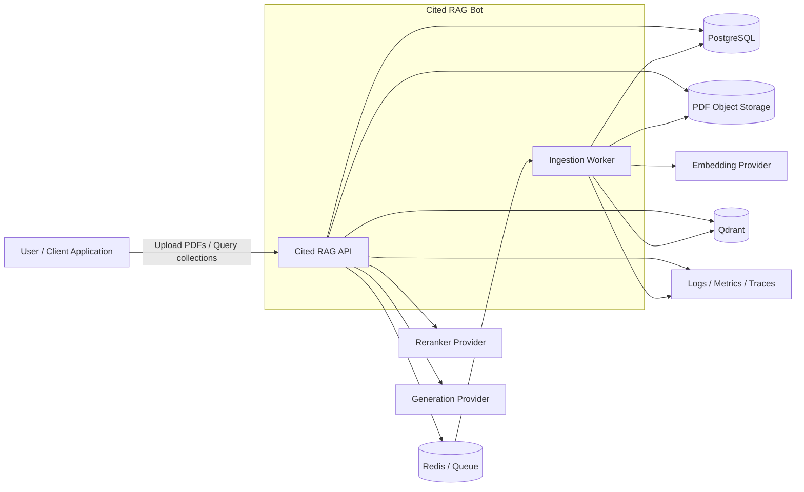

# 01 — System Context Diagram

## Purpose

Shows the major users, external providers, runtime services, and infrastructure boundaries around Cited RAG Bot.

## Boundary Notes

- The API owns synchronous client interactions.
- The worker owns long-running ingestion.
- PostgreSQL owns durable application metadata and provenance.
- Qdrant owns searchable dense/sparse retrieval representations.
- Redis coordinates asynchronous work and must not become the authoritative metadata store.
- Object storage retains source PDFs.
- Embedding, reranking, and generation providers remain replaceable behind adapters.
