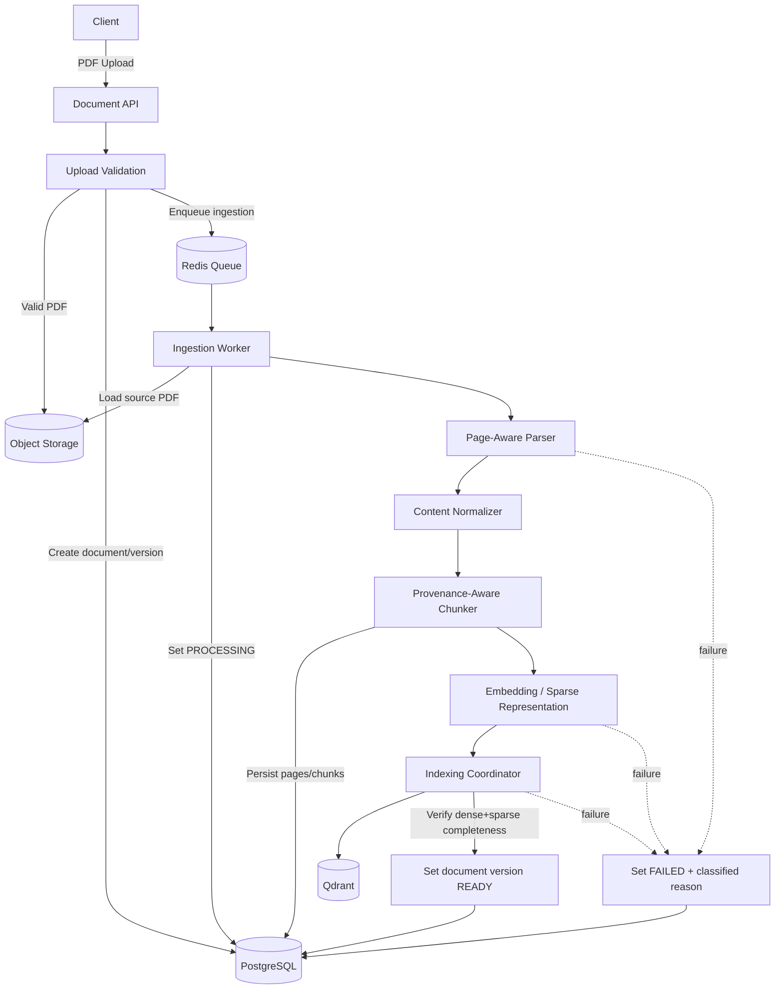

# 02 — PDF Ingestion Architecture

## Purpose

Shows how an uploaded PDF becomes a collection of searchable, provenance-aware evidence records.



## Ingestion Contract

A document may become `READY` only after all mandatory V1 retrieval artifacts are successfully created.

The expected lifecycle is:

```text
UPLOADED
   ↓
QUEUED
   ↓
PROCESSING
   ├──→ READY
   └──→ FAILED
READY → DELETING → DELETED
```

`READY` requires PostgreSQL provenance plus dense and sparse named vectors on each chunk UUID (ADR-011).

## Provenance Requirement

Every chunk produced by ingestion must retain at minimum:

```text
collection_id
document_id
document_version
page_number / explicit page range
chunk_id
chunk_order
normalized_text
```

## Failure Principle

Partial indexing is not success. Retry/recovery must be idempotent at document-version level and will be specified in the LLD.
