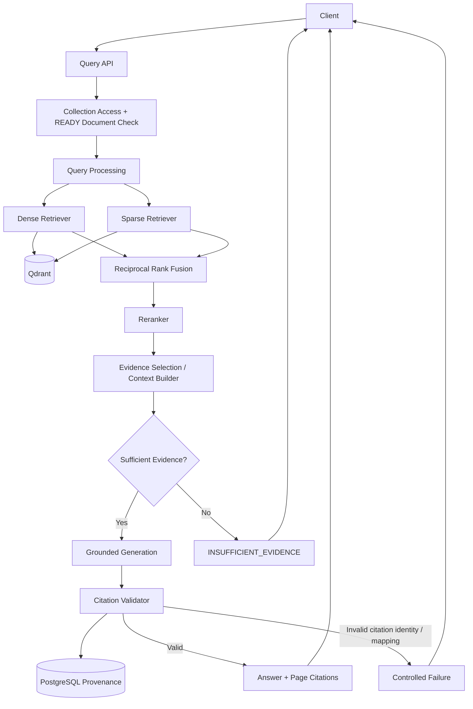

# 03 — Query and Retrieval Architecture

## Purpose

Shows how a user question becomes a grounded answer with validated PDF page citations.



## Query Pipeline

```text
Question
   ↓
Collection-scoped validation + active READY version filter
   ↓
Dense retrieval + Sparse retrieval
(both filter collection_id and active READY version ids)
   ↓
RRF fusion
   ↓
Reranking
   ↓
Evidence selection
   ↓
Evidence sufficiency decision
   ↓
Grounded generation
   ↓
Deterministic citation validation
   ↓
Answer + document/page citations
```

## Critical Trust Boundary

The LLM receives only the evidence selected by the context builder. It does not receive direct access to Qdrant, PostgreSQL, or source PDFs.

The model may reference only application-generated evidence IDs. The application maps those IDs back to authoritative document/page/chunk provenance.

## No-Answer Principle

No-answer is an expected outcome, not an exception. If the evidence cannot support a trustworthy response, the system returns `INSUFFICIENT_EVIDENCE` rather than filling gaps from model knowledge.
