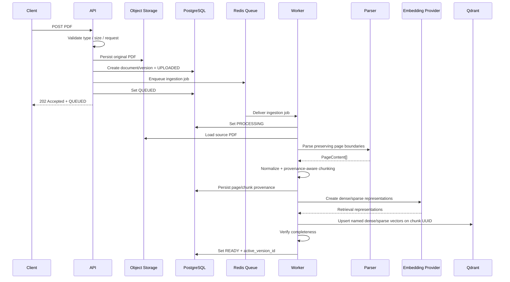
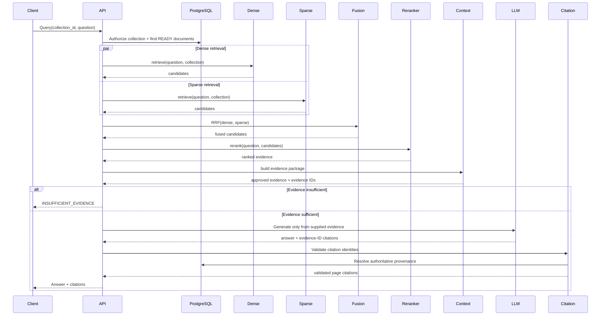
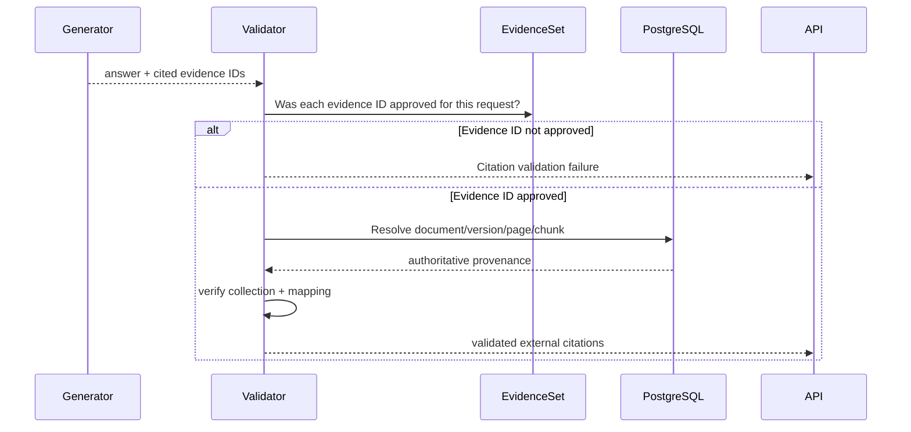

# 04 — Runtime Sequence Diagrams

## A. Upload and Asynchronous Ingestion

## B. Online Query

## C. Citation Validation

## Design Rule

Provider retries, retrieval degradation, generation repair, and ingestion retry behavior must be made explicit in LLD. These diagrams describe the successful logical path and the major controlled branches, not hidden retry loops.
