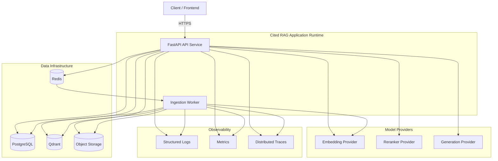

# 05 — Deployment and Runtime Architecture

## Purpose

Shows the proposed runtime separation for local development and production-oriented deployment.



## Local Development

A practical local stack may run:

```text
FastAPI
Ingestion Worker
PostgreSQL
Redis
Qdrant
Local filesystem object-storage adapter
```

through Docker Compose where useful.

Model providers may initially remain hosted APIs or local adapters depending on the accepted provider ADRs.

## Production-Oriented Shape

The architecture should allow API and ingestion workers to scale independently.

```text
Load Balancer / API Gateway
          ↓
     API replicas

Redis-backed queue
          ↓
   Worker replicas

Shared infrastructure:
PostgreSQL
Qdrant
Object Storage
Observability backend
```

## Scaling Principle

Do not scale ingestion and online queries as one unit. Their workload characteristics differ significantly:

- ingestion is CPU/network intensive and long-running;
- online query serving is latency sensitive;
- model provider calls may independently dominate latency;
- storage/index workloads need independent capacity planning.

## Failure Domains

The LLD must define explicit behavior for:

- PostgreSQL unavailable;
- Redis unavailable;
- Qdrant unavailable;
- object storage unavailable;
- embedding provider unavailable;
- reranker unavailable;
- generation provider unavailable.

No dependency failure should silently convert into an apparently successful but ungrounded answer.
