# 06 — Data Provenance and Citation Lineage

## Purpose

Shows the most important invariant in the project: every final citation must be traceable back to exact evidence derived from a PDF page.

```mermaid
flowchart LR
    PDF[Source PDF]
    PAGE[Parsed Page]
    CHUNK[Chunk]
    INDEX[Retrieval Point]
    RETRIEVED[Retrieved Candidate]
    RERANKED[Reranked Evidence]
    CONTEXT[Approved Context Evidence]
    MODEL[Generated Answer]
    CITATION[Validated Citation]

    PDF -->|document_id + version| PAGE
    PAGE -->|page_number| CHUNK
    CHUNK -->|chunk_id| INDEX
    INDEX --> RETRIEVED
    RETRIEVED --> RERANKED
    RERANKED --> CONTEXT
    CONTEXT -->|application evidence_id| MODEL
    MODEL -->|references evidence_id| CITATION

    META[(PostgreSQL Provenance)]

    PAGE --> META
    CHUNK --> META
    CITATION -->|resolve evidence lineage| META
```



## Minimum Lineage

```text
collection_id
   ↓
document_id
   ↓
document_version
   ↓
page_number
   ↓
chunk_id
   ↓
retrieved candidate
   ↓
reranked evidence
   ↓
request-scoped evidence_id
   ↓
model citation
   ↓
validated external citation
```

## Why Request-Scoped Evidence IDs Matter

The model should not manufacture raw document IDs, chunk IDs, or page numbers. The context builder assigns controlled evidence identifiers such as:

```text
E1
E2
E3
```

The model may cite only those identifiers. The citation validator then resolves `E1` back to authoritative provenance.

Example:

```text
E1
 ↓
chunk_789
 ↓
document_version_3
 ↓
policy.pdf
 ↓
page 17
```

This prevents a model-generated citation such as `page 92` from being trusted merely because it looks structurally valid.

## Citation Validity vs Citation Correctness

These are deliberately separate.

### Citation validity

Can be checked deterministically online:

- evidence ID existed;
- evidence was supplied to the model;
- chunk/document/page mapping exists;
- evidence belongs to the queried collection.

### Citation correctness

Requires evaluation of whether the cited evidence actually supports the claim.

This belongs in Step 5 evaluation design and the evaluation harness, not in a simplistic ID validation check.
